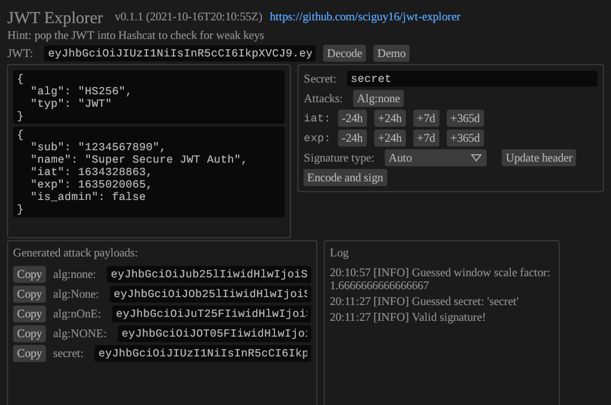

# JWT Explorer

A utility for inspecting, modifying, and attacking JWTs.

Supports Windows and Linux and probably also works on macOS but this has not been tested.



## Usage

```bash
cargo run --release
```

Or download the latest release for your platform from [the releases page](https://github.com/sciguy16/jwt-explorer/releases)!

## Features

* Decode JWTs and inspect the headers and claims
* Automatically try some common secrets
* Generate `alg:none` attack payloads
* Easily update `iat` and `exp` with various offsets
* Sign and encode tokens with common algorithms
* Accept and encode invalid JSON payloads
* Alter the claims while retaining the original signature
* Signature types: HMAC-SHA, ECDSA, RSASSA-PKCS1-v1_5

## Attacks
<dl>
	<dt>alg:none</dt>
	<dd>
		"Sign" the JWT with an empty signature and set the algorithm type to "None".
		Accepted by some implementations which trust the JWT's choice of signature algorithm.
		Some parsers check for "none" but don't check for e.g. "nOnE".
		Make sure to try with and without the trailing dot.
	</dd>
	<dt>Null signature</dt>
	<dd>
		Leave the original header intact but don't provide a signature.
		Make sure to try with and without the trailing dot.
	</dd>
	<dt>Guess common secrets</dt>
	<dd>
		If the token has been signed with an HMAC then try a few common secrets.
		This is not a substitute for passing the token to Hashcat, but can get some easy wins.
	</dd>
</dl>

## License

JWT Explorer is available under the terms of either the MIT license or
the Apache License (Version 2.0).

Fonts used are distributed under the terms of the Open Font License.

JWT Explorer binaries include a statically linked copy of [OpenSSL](https://github.com/openssl/openssl) which is distributed under the terms of the Apache License 2.0.

See [LICENSE-APACHE](LICENSE-APACHE), [LICENSE-MIT](LICENSE-MIT), and
fonts/\*/LICENSE for details.
